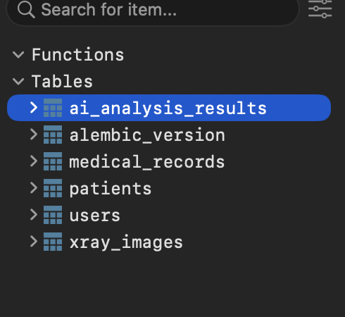
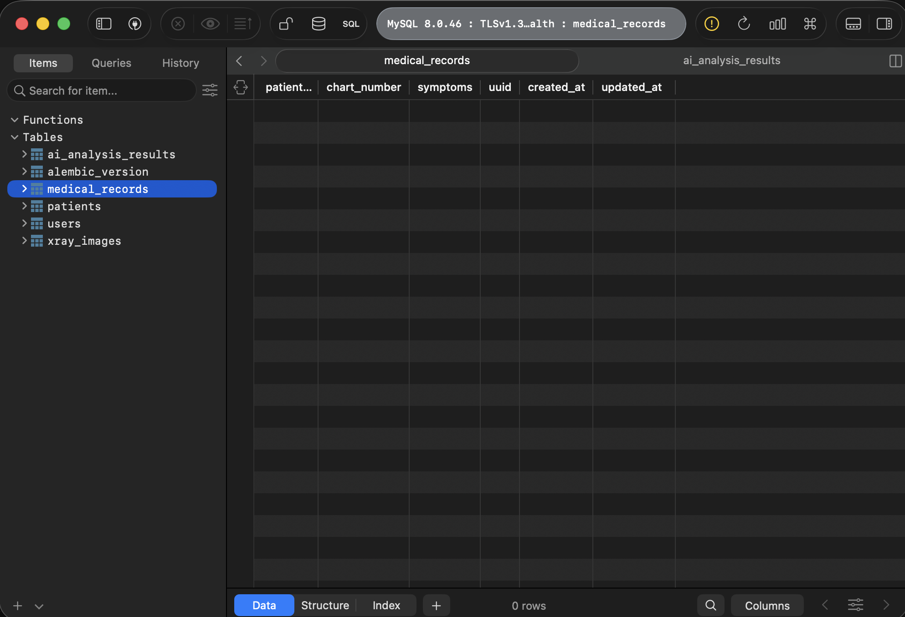
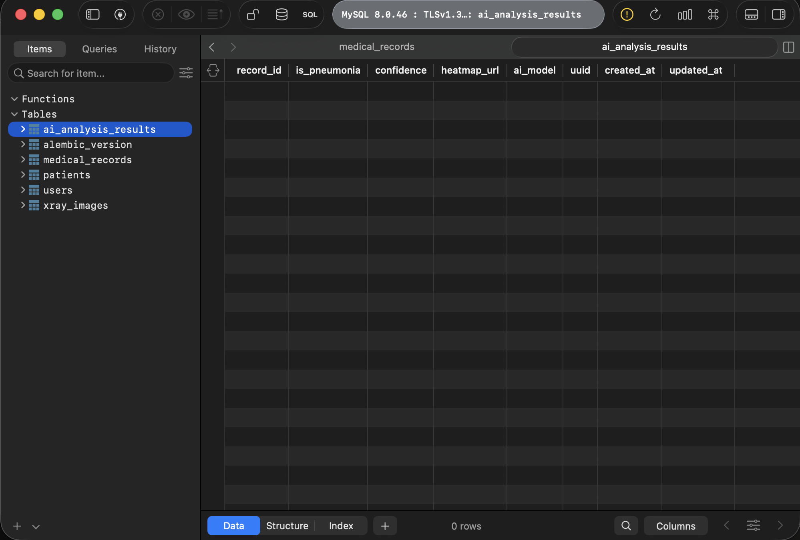

# 3일차 DB 마이그레이션

## 개요

`medical_records`, `ai_analysis_results` 테이블에 대한 SQLAlchemy 모델을 작성하고, Alembic을 이용해 마이그레이션을 생성 및 적용했다. 담당 테이블 외에도 팀원들이 작업한 `patients`, `users`, `xray_images` 테이블까지 모두 로컬 MySQL 데이터베이스에 정상적으로 반영된 것을 DB Viewer(TablePlus)로 확인했다.

## 작업 내용

1. `app/models/medical_record.py`, `app/models/ai_analysis_result.py` 모델 작성
   - 팀 컨벤션에 맞춰 `UUIDMixin`, `TimestampMixin`을 상속받는 방식으로 구현
   - `medical_records.patient_id` → `patients.uuid` 외래키 연결
   - `ai_analysis_results.record_id` → `medical_records.uuid` 외래키 연결
2. `app/models/__init__.py`에 전체 모델 import 추가 (Alembic autogenerate가 인식하도록)
3. `uv run alembic revision --autogenerate -m "add medical_records and ai_analysis_results tables"` 로 마이그레이션 파일 생성
4. `uv run alembic upgrade head` 로 로컬 MySQL에 스키마 적용
5. PR(`feat/medical-ai-models-fix`) 생성 후 `main` 브랜치에 머지 완료

## 마이그레이션 결과 확인 (DB Viewer)

### 전체 테이블 목록

`users`, `patients`, `medical_records`, `ai_analysis_results`, `xray_images` 테이블이 모두 정상적으로 생성된 것을 확인했다.

### medical_records 테이블 스키마

`patient_id`, `chart_number`, `symptoms`, `uuid`, `created_at`, `updated_at` 컬럼이 설계한 대로 생성되었다.

### ai_analysis_results 테이블 스키마

`record_id`, `is_pneumonia`, `confidence`, `heatmap_url`, `ai_model`, `uuid`, `created_at`, `updated_at` 컬럼이 설계한 대로 생성되었다.

## 결론

담당 테이블(`medical_records`, `ai_analysis_results`)의 모델과 마이그레이션 파일이 PR을 통해 `main` 브랜치에 머지되었고, DB Viewer를 통해 실제 스키마가 정상 적용된 것을 확인했다.