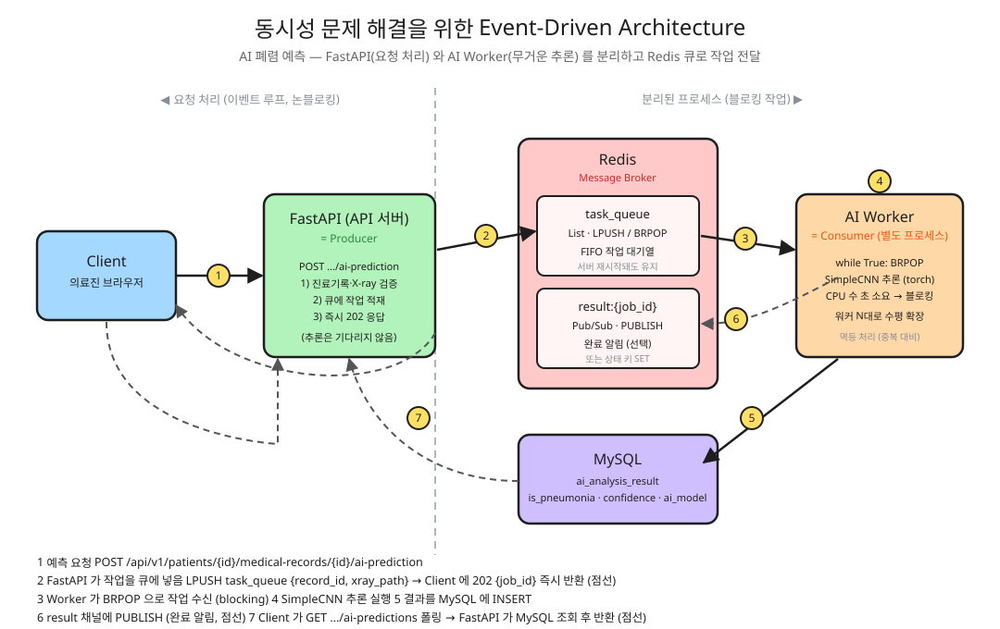
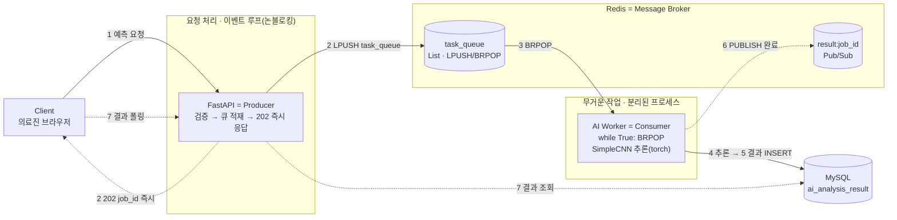

# 9일차 - FastAPI와 Redis를 이용한 Event-Driven Architecture 설계

## 핵심 용어 정리

| 용어 | 의미 |
|---|---|
| Event Loop(이벤트 루프) | 하나의 스레드가 여러 작업을 번갈아 처리하는 실행 구조. FastAPI(uvicorn)는 이 방식으로 동작한다 |
| Blocking(블로킹) | 작업이 끝날 때까지 다른 작업을 처리하지 못하고 멈춰있는 상태 |
| Non-blocking(논블로킹) | 작업이 끝나기를 기다리지 않고 다른 작업을 계속 처리할 수 있는 상태 |
| Event-Driven Architecture(이벤트 기반 아키텍처) | 어떤 동작(이벤트)이 발생했다는 사실만 전달하고, 그 처리는 별도 주체가 맡는 구조 |
| Producer / Consumer | 이벤트(작업)를 만들어내는 쪽(Producer)과 그걸 가져가 처리하는 쪽(Consumer) |
| Message Broker(메시지 브로커) | Producer와 Consumer 사이에서 메시지를 전달·중계하는 중간 서버. Redis, RabbitMQ, Kafka가 대표적 |
| Message Queue(메시지 큐) | 메시지를 순서대로 저장했다가 하나씩 꺼내 쓰는 자료구조. 한 메시지는 하나의 Consumer만 가져간다 |
| Pub/Sub(발행-구독) | 하나의 메시지를 구독 중인 모든 Consumer가 동시에 받는 방식. 큐와 달리 메시지가 여러 곳으로 복제되어 전달된다 |
| Consumer Group(컨슈머 그룹) | 여러 Consumer를 묶어서, 하나의 스트림을 그룹 단위로 나눠 처리하게 하는 단위 |
| At-least-once delivery | 메시지가 최소 한 번은 처리됨을 보장. 대신 중복 처리될 수 있음 |
| At-most-once delivery | 메시지가 최대 한 번만 처리됨을 보장. 대신 유실될 수 있음 |
| Idempotency(멱등성) | 같은 요청을 여러 번 처리해도 결과가 한 번 처리한 것과 같은 성질. at-least-once 환경에서 중복 처리 대비에 필요 |

## 동시성 문제: 왜 생기는가

FastAPI는 이벤트 루프 하나로 여러 요청을 처리한다. 요청 A가 DB 응답을 기다리는 동안(I/O 대기), 그 틈에 요청 B를 처리한다. 대기 시간이 많은 요청일수록 이 구조에서 유리하다.

문제는 대기가 아니라 계산 자체가 오래 걸리는 작업이다. LLM 추론, 이미지 처리, 음성-텍스트 변환 같은 CPU 연산은 그 동안 이벤트 루프에 다른 작업을 끼워 넣을 틈이 없다. 이런 작업을 엔드포인트 안에서 동기적으로 실행하면, 그 작업이 끝날 때까지 이벤트 루프 전체가 멈춘다(블로킹). 한 요청이 3초짜리 추론을 도는 동안 다른 사용자의 요청은 전부 대기 상태가 된다.

정리하면 동시성 문제는 "I/O 대기"와 "CPU 연산"을 같은 방식으로 다뤄서 생기는 문제다. 비동기 프레임워크는 전자에는 강하지만 후자를 그대로 넣으면 이점이 사라진다.

## 해결 방법 비교

| 방법 | 구현 난이도 | 서버 재시작 시 작업 | 확장성 |
|---|---|---|---|
| `BackgroundTasks` / `run_in_threadpool` | 낮음 | 유실됨 | 서버 한 대 안에서만 처리 |
| Redis 큐 + 별도 워커 프로세스 | 중간 | 큐에 남아있어 유지됨 | 워커를 늘리면 처리량 증가 |
| Celery + Redis | 중간~높음 | 브로커에 남아있어 유지됨 | 워커 추가, 재시도, 스케줄링까지 지원 |

### 같은 프로세스에서 처리

`BackgroundTasks`나 `run_in_threadpool`로 무거운 작업을 별도 스레드에 넘기는 방법이다. 별도 인프라 없이 바로 쓸 수 있지만, 서버 프로세스가 재시작되면 처리 중이던 작업이 그대로 사라진다. 서버 한 대에서만 도는 구조라 요청이 몰리면 그 한 대가 부하를 전부 떠안는다.

### 별도 프로세스로 분리 — Event-Driven Architecture

API 서버(Producer)는 작업을 큐에 넣고 바로 응답한다. 워커(Consumer)는 별도 프로세스로 떠서 큐를 지켜보다가 작업을 꺼내 처리한다.

```
클라이언트 → FastAPI(Producer) → Redis(Broker/Queue) → Worker(Consumer) → 결과 저장/알림
```

API 서버는 "작업이 생겼다"는 이벤트만 발생시키고 그 이후 처리는 신경 쓰지 않는다. 워커가 그 이벤트를 가져가 처리한다. 이렇게 이벤트 발생과 이벤트 처리를 분리하는 구조를 이벤트 기반 아키텍처라 부른다. API 서버가 재시작돼도 큐에 쌓인 작업은 Redis(Broker)에 그대로 남고, 워커를 여러 대 띄우면 처리량도 그만큼 늘어난다.

## Redis로 큐 구현하기: List vs Streams

| 구분 | List (LPUSH/BRPOP) | Streams (XADD/XREADGROUP) |
|---|---|---|
| 메시지 소비 방식 | 가져간 순간 큐에서 사라짐 | 소비돼도 로그처럼 남음 |
| 실패 시 복구 | 불가능 (유실) | `XAUTOCLAIM`으로 재할당 가능 |
| 다중 Consumer 처리 | 순서대로 하나씩 분배 | Consumer Group으로 그룹 단위 분배 |
| 전달 보장 | 없음 | at-least-once |
| 구현 난이도 | 낮음 | 중간 |

### List 기반

Redis List를 큐로 쓴다.

```python
# Producer(API 서버) - 작업을 큐에 넣기
redis_client.lpush("task_queue", json.dumps({
    "channel_id": channel_id,
    "user_prompt": user_prompt,
}))

# Consumer(워커) - 큐에서 작업 꺼내기 (블로킹)
task = redis_client.brpop("task_queue")
task_dict = json.loads(task[1])
```

`BRPOP`은 큐가 비어있으면 새 작업이 들어올 때까지 대기한다. 워커를 `while True`로 계속 돌리면서 큐를 지키는 구조가 나온다. 한계는 메시지를 가져간 워커가 처리 도중 죽으면 그 작업이 그대로 유실된다는 점이다. 재시도나 실패 복구가 필요 없는 단순한 파이프라인에는 충분하다.

### Streams 기반

- `XADD`로 이벤트를 스트림에 추가한다.
- `XREADGROUP`으로 Consumer Group 단위로 아직 처리 안 된 메시지(`>`)를 읽는다.
- 처리가 끝나면 `XACK`로 확인 처리한다. 확인 전까지는 "처리 중" 상태로 남는다.
- 워커가 죽어서 확인을 못 하고 일정 시간(예: 60초)이 지난 메시지는 `XAUTOCLAIM`으로 다른 워커가 다시 가져간다.

메시지가 확인되기 전까지 스트림에 남아있기 때문에 at-least-once delivery가 가능하다. 대신 같은 메시지가 두 번 처리될 수 있으니, Consumer 쪽 로직이 멱등성을 갖추고 있어야 한다(예: 이미 처리한 작업 ID면 건너뛰기).

## Celery: 큐 로직을 프레임워크에 맡기기

`BRPOP`으로 워커를 직접 짜는 대신, Celery라는 태스크 큐 프레임워크를 쓸 수 있다. 구성 요소는 세 가지다.

| 구성 요소 | 역할 |
|---|---|
| Broker | 태스크 메시지를 저장하고 중계 (Redis, RabbitMQ 등) |
| Worker | 큐에서 태스크를 꺼내 실행 |
| Result Backend | 처리 결과를 저장 (조회용) |

```python
celery_app = Celery(
    __name__,
    broker="redis://redis:6379/0",
    backend="redis://redis:6379/0",
)

@celery_app.task
def run_inference(prompt: str):
    ...
    return {"status": "success", "result": answer}
```

API 서버는 `run_inference.delay(prompt)`로 태스크를 호출만 하고 즉시 응답한다. 재시도, 여러 워커로의 분산, 작업 체이닝(`chain`으로 A 작업 결과를 B 작업 입력에 자동 전달), 주기적 작업 스케줄링(Celery Beat), 모니터링(Flower)을 프레임워크가 대신 관리해준다. 직접 큐 로직을 짜는 것보다 견고하지만, 그만큼 익혀야 할 개념과 설정이 늘어난다.

## 실습 구조: 직접 만든 최소 버전

이번 실습(`docker/api`, `docker/worker`)에서 만든 게 List 큐 방식의 최소 버전이다.

- `api`(Producer): FastAPI 엔드포인트가 요청을 받으면 Redis 큐(`task_queue`)에 작업을 넣고 바로 응답한다.
- `worker`(Consumer): `while True` 루프에서 `BRPOP`으로 큐를 지키다가, 작업이 들어오면 `llama-cpp-python`으로 로드해둔 LLaMA 모델에 프롬프트를 넣어 추론하고, 결과를 `PUBLISH`로 알린다.

```python
def run():
    while True:
        task = redis_client.brpop("task_queue")
        task_dict = json.loads(task)

        channel_id = task_dict["channel_id"]
        user_prompt = task_dict["user_prompt"]

        response = llm.create_chat_completion(
            messages=[
                {"role": "system", "content": SYSTEM_PROMPT},
                {"role": "user", "content": user_prompt},
            ],
            max_tokens=256,
            temperature=0.7,
        )
        answer = response["choices"][0]["message"]["content"]

        redis_client.publish(channel_id, answer)
```

`api`, `db`, `redis`, `worker`를 각각 컨테이너로 띄우고 `docker-compose.yml`의 `depends_on`으로 실행 순서만 정하면, LLM 추론이 API 서버의 이벤트 루프와 완전히 분리된다. API 서버는 큐에 넣는 즉시 응답하고, 실제 추론은 `worker` 컨테이너에서 독립적으로 진행된다.

`redis_client.publish(channel_id, answer)`는 Pub/Sub 패턴이다. 결과를 받을 쪽이 `SUBSCRIBE channel_id`로 미리 그 채널을 구독하고 있어야 메시지를 받는다. `SUBSCRIBE`는 구독 이후 발행되는 메시지만 받고, 구독 이전에 지나간 메시지는 받지 못한다 — 큐와 달리 받는 쪽이 항상 연결돼 있어야 한다는 조건이 붙는다.

## 정리

| 판단 기준 | 적합한 방법 |
|---|---|
| 빠르게 구현하고, 작업 유실 위험을 감수할 수 있다 | `BackgroundTasks` |
| 작업 유실 없이 서버 재시작에도 안전해야 한다 | Redis List 큐 + 워커 |
| 실패한 작업을 자동으로 복구해야 한다 | Redis Streams |
| 재시도, 스케줄링, 모니터링까지 프레임워크로 관리하고 싶다 | Celery |

무거운 작업을 이벤트 루프 밖으로 빼는 방법은 이렇게 단계가 나뉜다. 지금 처리하려는 작업이 유실돼도 되는지, 얼마나 자주 실패할 수 있는지, 워커를 몇 대까지 늘릴 계획인지에 따라 선택이 달라진다.

## 아키텍처 도식 (Event-Driven Architecture 설계)

이 프로젝트의 **AI 폐렴 예측** 기능을 Event-Driven Architecture로 설계한 도식이다.
`POST .../ai-prediction` 요청이 오면 FastAPI는 작업을 Redis 큐에 넣고 즉시 `202`로 응답하며,
실제 `SimpleCNN` 추론은 별도 프로세스인 **AI Worker**가 큐에서 꺼내 처리한다.
FastAPI의 이벤트 루프는 추론 시간 동안 블로킹되지 않는다.



### 처리 흐름

| # | 주체 | 동작 |
|---|---|---|
| 1 | Client → FastAPI | `POST /api/v1/patients/{patient_id}/medical-records/{record_id}/ai-prediction` |
| 2 | FastAPI (Producer) | 진료기록·X-ray 검증 후 `LPUSH task_queue {record_id, xray_path}` → **즉시 `202 {job_id, status:"queued"}` 반환** |
| 3 | AI Worker (Consumer) | `while True` 루프에서 `BRPOP task_queue` 로 작업 수신 (큐가 비면 대기) |
| 4 | AI Worker | 로드해 둔 `SimpleCNN`(torch)으로 X-ray 추론 — CPU로 수 초, **이 프로세스만** 블로킹 |
| 5 | AI Worker → MySQL | 결과를 `ai_analysis_result`(`is_pneumonia`, `confidence`, `ai_model`)에 저장 |
| 6 | AI Worker → Redis | `PUBLISH result:{job_id}` 로 완료 알림 (또는 상태 키 `SET`) — 선택 |
| 7 | Client → FastAPI → MySQL | `GET .../ai-predictions` 폴링(또는 SSE/WebSocket 구독)으로 결과 조회 |

### 텍스트로 보는 흐름



### 컴포넌트 분리 (FastAPI ↔ AI Worker)

- **FastAPI (요청 처리 영역)** — 이벤트 루프에서 요청을 받아 큐에 넣는 데까지만 담당. I/O 대기 위주라 논블로킹으로 다수 요청을 동시 처리한다. 추론 결과를 기다리지 않는다.
- **AI Worker (무거운 작업 영역)** — API 서버와 **별도 프로세스/컨테이너**. torch 추론 같은 CPU 연산을 전담하며, 블로킹되어도 API 서버 이벤트 루프에는 영향이 없다. 워커를 N대로 늘리면 처리량이 그만큼 증가한다.
- **Redis (Message Broker)** — 두 영역의 결합을 끊는 지점.
  - `task_queue` (List, `LPUSH`/`BRPOP`) — FIFO 작업 대기열. **API 서버가 재시작돼도 큐에 쌓인 작업은 유지**된다.
  - `result:{job_id}` (Pub/Sub) — 완료 이벤트 전파. 구독 중인 쪽에만 전달되므로, 확실한 결과 전달은 MySQL 조회(폴링)로 보완한다.

### 장애 · 중복 처리

- 워커가 추론 도중 죽으면 `BRPOP`로 꺼낸 작업은 유실된다. 유실을 막아야 하면 List 대신 **Redis Streams**(`XREADGROUP` + `XACK` + `XAUTOCLAIM`)로 바꿔 at-least-once를 보장한다.
- at-least-once 환경에서는 같은 작업이 두 번 처리될 수 있으므로, 워커는 `(record_id, ai_model)` 조합으로 **이미 결과가 있으면 건너뛰는 멱등 처리**를 둔다. (현재 `ai_analysis_result` 에 해당 조합 인덱스가 있어 캐시 조회로 활용 가능하다.)

> 도식 원본은 excalidraw 스타일로 작성한 SVG(`docs/images/9일차_eda_아키텍처.svg`)이며 GitHub 마크다운에서 바로 렌더링된다.

## 구현 (아키텍처 설계에 따라 AI 작업 워커 분리)

위 설계를 **List 큐 + 별도 워커 프로세스** 방식으로 구현했다. FastAPI 는 추론 결과를
동기 응답으로 돌려주는 기존 계약(`201`/`200`)을 유지하되, 실제 추론은 큐를 통해
워커에 위임하고 결과 Pub/Sub 을 구독해 기다린다.

| 구분 | 파일 | 역할 |
|---|---|---|
| Producer (app) | `app/core/redis_client.py` | Redis **비동기** 클라이언트 (`redis.asyncio`) |
| Producer (app) | `app/services/ai_prediction_service.py` | ① DB 캐시 조회 → ② `LPUSH task_queue` → ③ `result:{job_id}` 구독 대기 → ④ 결과를 DB 저장 후 응답 |
| Consumer (worker) | `worker/redis_client.py` | Redis **동기** 클라이언트 |
| Consumer (worker) | `worker/main.py` | `while True` 로 `BLMOVE` → `SimpleCNN` 추론 → `PUBLISH result:{job_id}` |
| 인프라 | `worker/Dockerfile`, `docker-compose.yml` | `ai-worker` / `redis` 서비스. `pyproject.toml` 의 `[dependency-groups].ai` 로 의존성 분리(torch 는 워커 이미지에만) |

### 설계 대비 선택

- **결과 저장 주체**: 설계 도식은 워커가 MySQL 에 직접 저장하는 선택지도 뒀지만,
  워커 이미지에서 DB 드라이버(asyncmy)를 빼 더 가볍게 유지하려고 **FastAPI 가 저장**하도록 했다.
  워커는 추론과 결과 발행만 담당한다.
- **동시 요청 (선택 요구사항)**: 같은 `(record_id, ai_model)` 요청이 겹치면 FastAPI 가
  Redis 분산 잠금(`pneumonia:lock:{record_id}:{model}`)으로 직렬화하고, 잠금 획득 직후
  DB 캐시를 재확인한다. 뒤늦게 잠금을 얻은 요청은 앞선 요청이 저장한 결과를 그대로
  캐시로 돌려주므로 중복 추론·중복 저장이 없다.
- **비정상 종료 복구 (선택 요구사항)**: `BRPOP` 대신 `BLMOVE` 로 작업을 워커별
  처리중(processing) 리스트에 옮겨 두고, 완료 시 `LREM` 한다. 추론 도중 죽으면
  다음 기동 때 처리중 리스트를 큐로 되돌린다(at-least-once 흉내).
- **폴링/202 방식은 채택하지 않음**: 프론트엔드/응답 스키마 변경을 피하려고
  요청-응답 계약을 그대로 두고, 큐 왕복을 `PREDICTION_TIMEOUT_SECONDS` 안에 끝낸다.
  타임아웃 시 `503`, 작업은 큐에 남아 다른 워커가 이어서 처리한다.
